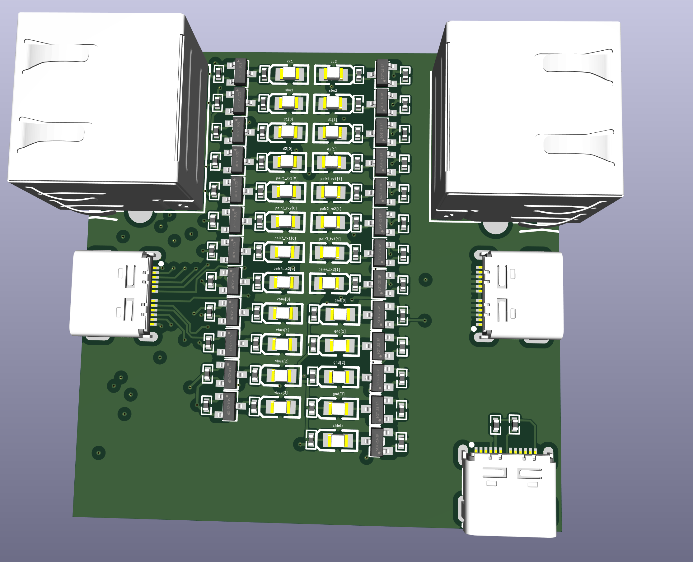
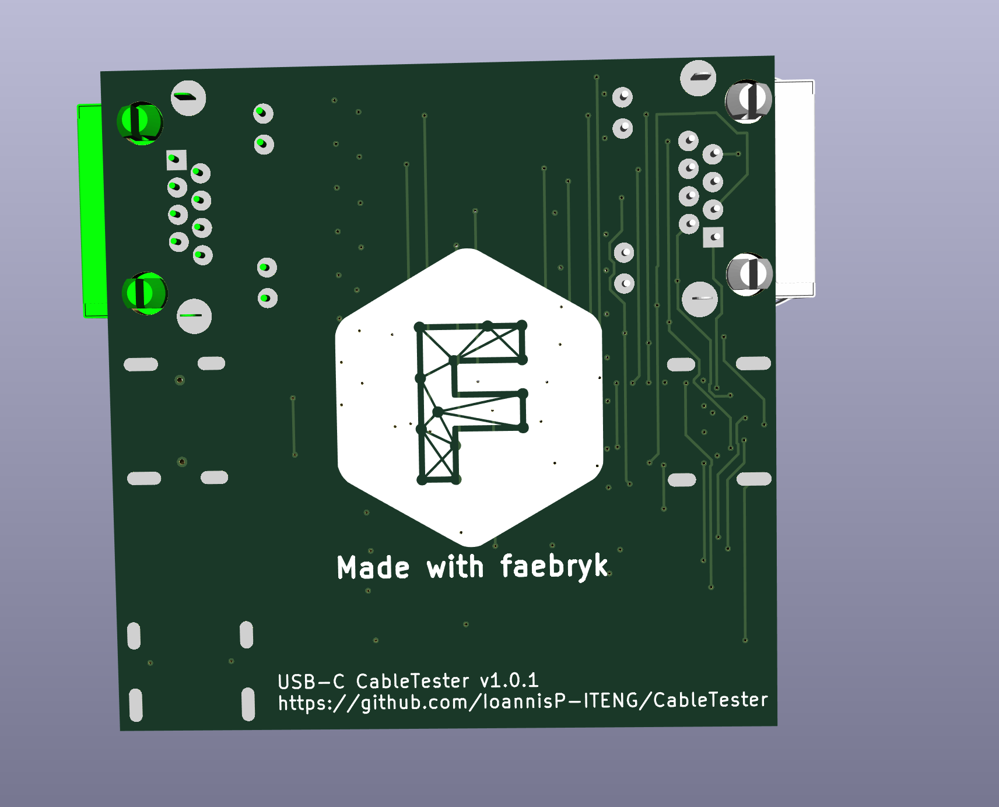
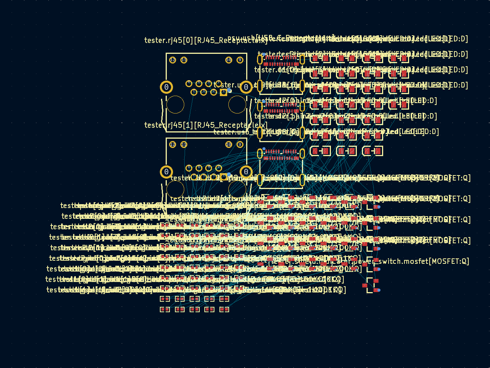
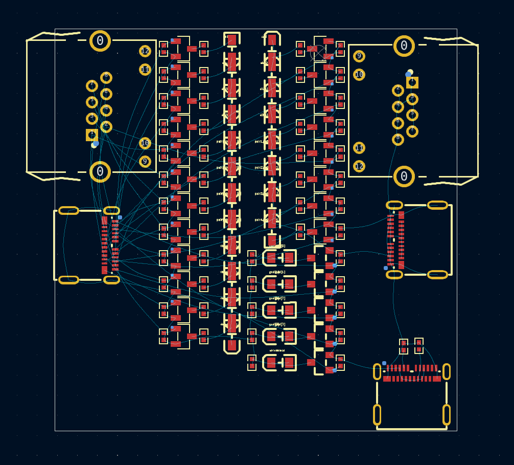

<div align="center">

# CableTester



<br/>

USB type-C and UTP cable tester designed in faebryk

[](https://github.com/IoannisP-ITENG/CableTester/releases) [](https://github.com/IoannisP-ITENG/CableTester/blob/main/LICENSE) [](https://github.com/IoannisP-ITENG/CableTester/pulls) [](https://github.com/IoannisP-ITENG/CableTester/issues) [](https://github.com/IoannisP-ITENG/CableTester/commits/main) [](https://github.com/psf/black)

</div>

## About

This is a simple USB type-C and UTP cable continuity tester. It lights up the LED corresponding to the strand it is testing when there is an electrical connection. The tester is powered with 5V via the PD compliant USB type-C connector.

This project is build with the open-source EDA [faebryk](https://github.com/faebryk/faebryk).

## What can you do with this project?

This project is usefull as a simple cable tester for UTP and USB type-C cables, however it is very easy to add additional connectors for different cable types due to faebryk.

The purpose of this project was mainly to showcase the funcionality of faebryk. The Cable tester is the very first PCBA manufactured from a faebryk design!

### Example

<details>
  <summary>An example of the power of faebryk for PCB design</summary>

</br>

Auto placing components.

```bash
# Generate the netlist with faebryk
python ./source/faebryk/main.py
INFO:__main__:Backup old netlist at ./source/kicad/main/main.net.bak
INFO:__main__:Writing Experiment netlist to ./source/kicad/main/main.net
INFO:__main__:Opening kicad to import new netlist
Import the netlist at ./source/kicad/main/main.net. Press 'Update 
PCB'. Place the components, save the file and exit kicad.

# Let faebryk auto-place your component in a parametric way
INFO:__main__:Writing pcbfile ./source/kicad/main/main.kicad_pcb
```

After importing the generated netlist into KiCad, the layout looks like this:



Let faebryk do the parametric auto placing by using transform functions and coordinates:

```python
# component, rotation
layout_rotation_degrees: List[Tuple[Component, int]] = [
    (pr, 270),
    (mos, 180),
    (clr, 270),
    (led, 0),
]

# left, up, right, down
component_clearances_mm = {
    LED_FP: (2.25, 1, 2, 1),
    RESISTOR_FP: (1, 0.5, 1, 0.5),
    MOSFET_FPS[0]: (2, 3.25, 2, 3.25),
    MOSFET_FPS[1]: (2, 3.25, 2, 3.25),
}
```

And you will get a parametrized PCB layout:



</details>

## Working with the source files

See [here](./docs/development.md) for the instructions on how to install and edit this project.

## Building

If you want to build the physical output of this project you can find the build instructions [here](./docs/build_instructions.md).

## Contributing

If you want to share your alterations, improvements, or add bugfixes to this project, please take a look at the [contributing guidelines](./docs/CONTRIBUTING.md).

## Community Support

Community support is provided via Discord; see the Resources below for details.

### Resources

- Source Code: [Github](https://github.com/IoannisP-ITENG/CableTester)
- Chat: Real-time chat happens in faebryk's Discord Server (chit-chat room for now). Use this Discord [Invite](https://discord.gg/95jYuPmnUW) to register
- Issues: [Issues](https://github.com/IoannisP-ITENG/CableTester/issues)
